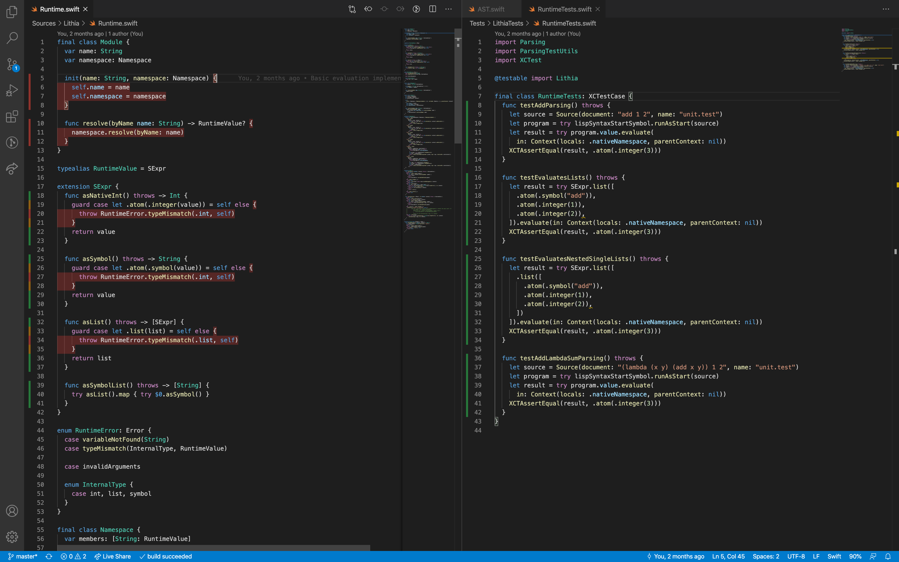

# swift-coverage

Display coverage reports next to your code for Swift Package Manager projects.



To update and show your coverage statistics, run your tests with code coverage enabled.

```bash
swift test --enable-code-coverage
```

## Configuration

| Config                                        | Type                    | Default                                       | Description                                                             |
| --------------------------------------------- | ----------------------- | --------------------------------------------- | ----------------------------------------------------------------------- |
| swift-coverage.coverageFilePattern            | `string`; glob pattern  | `**/.build/*/debug/{coverage,codecov}/*.json` | The pattern where to find the llvm-codecov JSON-reports.                |
| swift-coverage.highlightsCoveredText          | `boolean`               | `false`                                       | Wether code with coverage should have a higlighted background.          |
| swift-coverage.highlightsNotCoveredText       | `boolean`               | `true`                                        | Wether code with no coverage should have a higlighted background.       |
| swift-coverage.coveredTextBackground.dark     | `string`, CSS-color     | `rgba(48, 209, 88, 0.25)`                     | The brackground color used to highlight code with coverage.             |
| swift-coverage.coveredTextBackground.light    | `string`, CSS-color     | `rgba(52, 199, 89, 0.25)`                     | The brackground color used to highlight code with coverage.             |
| swift-coverage.notCoveredTextBackground.dark  | `string`, CSS-color     | `rgba(255, 69, 58, 0.25)`                     | The brackground color used to highlight code with no coverage.          |
| swift-coverage.notCoveredTextBackground.light | `string`, CSS-color     | `rgba(255, 59, 48, 0.25)`                     | The brackground color used to highlight code with no coverage.          |
| swift-coverage.highlightsCoveredGutter        | `boolean`               | `true`                                        | Wether lines with coverage should have a highlight-gutter.              |
| swift-coverage.highlightsNotCoveredGutter     | `boolean`               | `true`                                        | Wether lines with no coverage should have a highlight-gutter.           |
| swift-coverage.highlightsMixedGutter          | `boolean`               | `true`                                        | Wether lines with mixed coverage should have a highlight-gutter.        |
| swift-coverage.coveredGutterIcon.dark         | `string`, absolute path | green indicator (builtin)                     | The path to the gutter-icon used to highlight code with coverage.       |
| swift-coverage.coveredGutterIcon.light        | `string`, absolute path | green indicator (builtin)                     | The path to the gutter-icon used to highlight code with coverage.       |
| swift-coverage.notCoveredGutterIcon.dark      | `string`, absolute path | red indicator (builtin)                       | The path to the gutter-icon used to highlight code without coverage.    |
| swift-coverage.notCoveredGutterIcon.light     | `string`, absolute path | red indicator (builtin)                       | The path to the gutter-icon used to highlight code without coverage.    |
| swift-coverage.mixedGutterIcon.dark           | `string`, absolute path | orange indicator (builtin)                    | The path to the gutter-icon used to highlight code with mixed coverage. |
| swift-coverage.mixedGutterIcon.light          | `string`, absolute path | orange indicator (builtin)                    | The path to the gutter-icon used to highlight code with mixed coverage. |

## Contributors

- Valentin Knabel, [@vknabel](https://github.com/vknabel)

## License

vscode-swift-coverage is available under the [MIT](./LICENSE) license.
